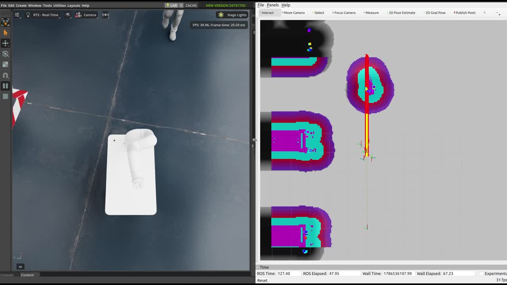

<div align="center">

# Moby · Isaac Sim · Nav2

**Isaac Sim 5.1 · ROS 2 Humble · Nav2 기반 Neuromeka Moby 자율주행 환경**

[English](README.md) · [데모 영상](docs/media/warehouse_nav_demo.mp4) · [Moby ROS 2 원본](https://github.com/neuromeka-robotics/moby-ros2)

</div>

[](docs/media/warehouse_nav_demo.mp4)

> 미리보기를 클릭하면 15초 데모 영상을 볼 수 있습니다. 이 영상은 현재 `simple_room`이
> 아니라 이전 warehouse map에서 녹화한 결과입니다.

## 핵심 기능

- Moby RP와 Indy RP2가 포함된 Isaac Sim 5.1 stage
- `/clock`, `/odom`, `/scan`, `/tf`, joint command를 위한 ROS 2 Humble bridge
- Nav2 global/local planning, map server, RViz 목표 지점 제어
- waypoint를 따라 실제로 걷는 Isaac People 작업자

## 요구 사항

Ubuntu 22.04, ROS 2 Humble, NVIDIA Isaac Sim 5.1.0, Python 3.10이 필요합니다.

## 실행

최초 한 번 빌드한 뒤, 아래 세 터미널을 순서대로 실행하고 모두 유지합니다.

<details open>
<summary><b>1. 빌드</b></summary>

```bash
export WORKSPACE=/path/to/moby-isaac-nav2
cd "$WORKSPACE"
source /opt/ros/humble/setup.zsh
rosdep install --from-paths src --ignore-src -r -y
colcon build --symlink-install
```

</details>

<details open>
<summary><b>2. 터미널 1 — Isaac Sim</b></summary>

```bash
export WORKSPACE=/path/to/moby-isaac-nav2
export ISAAC_SIM_ROOT=/path/to/isaac-sim_5.1.0
cd "$WORKSPACE"
./scripts/run_isaac_sim.sh \
  --source-usd src/isaac_moby_sim/assets/scenes/moby_simple_room_final.usd
```

</details>

<details open>
<summary><b>3. 터미널 2 — joint commander</b></summary>

```bash
export WORKSPACE=/path/to/moby-isaac-nav2
cd "$WORKSPACE"
source /opt/ros/humble/setup.zsh
source install/setup.zsh
export FASTDDS_BUILTIN_TRANSPORTS=UDPv4
ros2 run isaac_moby_controller moby_joint_commander
```

</details>

<details open>
<summary><b>4. 터미널 3 — Nav2와 RViz</b></summary>

```bash
export WORKSPACE=/path/to/moby-isaac-nav2
cd "$WORKSPACE"
source /opt/ros/humble/setup.zsh
source install/setup.zsh
export FASTDDS_BUILTIN_TRANSPORTS=UDPv4
ros2 launch isaac_moby_navigation navigation.launch.py use_sim_time:=true use_rviz:=true
```

</details>

RViz에 방 지도가 나타나면 **2D Goal Pose**를 선택한 뒤, 지도에서 빈 공간을 클릭하고
drag하여 방향을 지정합니다. global plan과 Isaac Sim의 로봇 이동이 보이면 성공입니다.

## 사람 왕복 이동

Terminal 1을 다음 명령으로 다시 시작합니다. 사람은 두 안전 waypoint 사이를 0.5 m/s로
걷습니다. 첫 waypoint는 Moby 초기 위치 `(0, 0, 0)`를 피하도록 정했습니다.

```bash
./scripts/run_isaac_sim.sh \
  --source-usd src/isaac_moby_sim/assets/scenes/moby_simple_room_final.usd \
  --people-motion-mode=kinematic \
  --people-speed-mps=0.5 \
  --people-waypoint=-6.0,-7.0,0.0 \
  --people-waypoint=-2.0,-7.0,0.0 \
  --people-start-at-first-waypoint \
  --people-loops=inf
```

## 환경 호환성

`scripts/run_isaac_sim.sh`가 실행 중인 Conda/preload 변수를 정리하고 Fast DDS를 UDP로
고정합니다. 이는 Isaac Sim의 bundled DDS와 여러 local ROS 2 process가 한 host에서
shared-memory를 함께 쓸 때 발생했던 Fast DDS 충돌을 피하기 위한 설정입니다. 일반적인
깨끗한 PC에서 Conda가 활성화되어 있지 않다면 `unset`은 아무 영향이 없고, UDP 설정은
Isaac Sim 자체의 필수 조건이 아니라 보수적인 호환성 선택입니다.

## 참고 및 asset

로봇 설명과 ROS 2 package 구성 방식은
[Neuromeka Moby ROS 2 Humble 저장소](https://github.com/neuromeka-robotics/moby-ros2)를
참고했습니다. 이 repository는 Neuromeka 공식 simulator package가 아니라, Isaac Sim
5.1 기반으로 별도 통합한 환경입니다.

`moby_simple_room_final.usd`는 `/World/moby/moby_rp`에서 local
`indy_rp2_v2.usd` asset을 참조합니다. 공개 전 USD asset과 외부 reference의 재배포
권한을 확인하세요.
