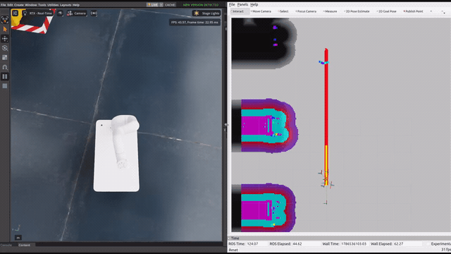

<div align="center">

# Moby · Isaac Sim · Nav2

**Neuromeka Moby navigation in Isaac Sim 5.1 with ROS 2 Humble and Nav2.**

[한국어](README.ko.md) · [Demo](docs/media/warehouse_nav_demo.mp4) · [Upstream Moby ROS 2](https://github.com/neuromeka-robotics/moby-ros2)

</div>

<div align="center">
  

  <p>A 15-second navigation demo recorded in an earlier warehouse map, not the current <code>simple_room</code> scene.<br>
  <a href="docs/media/warehouse_nav_demo.mp4">Open the original MP4</a></p>
</div>

## Highlights

- Isaac Sim 5.1 stage with Moby RP and Indy RP2
- ROS 2 Humble bridge for `/clock`, `/odom`, `/scan`, `/tf`, and joint commands
- Nav2 global/local planning, map server, and RViz goal control
- Animated Isaac People worker that walks a deterministic waypoint route

## Requirements

Ubuntu 22.04, ROS 2 Humble, NVIDIA Isaac Sim 5.1.0, and Python 3.10.

## Run

Build once, then keep the three terminals below running in order.

<details open>
<summary><b>1. Build</b></summary>

```bash
export WORKSPACE=/path/to/moby-isaac-nav2
cd "$WORKSPACE"
source /opt/ros/humble/setup.zsh
rosdep install --from-paths src --ignore-src -r -y
colcon build --symlink-install
```

</details>

<details open>
<summary><b>2. Terminal 1 — Isaac Sim</b></summary>

```bash
export WORKSPACE=/path/to/moby-isaac-nav2
export ISAAC_SIM_ROOT=/path/to/isaac-sim_5.1.0
cd "$WORKSPACE"
./scripts/run_isaac_sim.sh \
  --source-usd src/isaac_moby_sim/assets/scenes/moby_simple_room_final.usd
```

</details>

<details open>
<summary><b>3. Terminal 2 — joint commander</b></summary>

```bash
export WORKSPACE=/path/to/moby-isaac-nav2
cd "$WORKSPACE"
source /opt/ros/humble/setup.zsh
source install/setup.zsh
export FASTDDS_BUILTIN_TRANSPORTS=UDPv4
ros2 run isaac_moby_controller moby_joint_commander
```

</details>

<details open>
<summary><b>4. Terminal 3 — Nav2 and RViz</b></summary>

```bash
export WORKSPACE=/path/to/moby-isaac-nav2
cd "$WORKSPACE"
source /opt/ros/humble/setup.zsh
source install/setup.zsh
export FASTDDS_BUILTIN_TRANSPORTS=UDPv4
ros2 launch isaac_moby_navigation navigation.launch.py use_sim_time:=true use_rviz:=true
```

</details>

Wait for the room map, choose **2D Goal Pose** in RViz, then click and drag in a
free area. A global plan and robot motion in Isaac Sim indicate success.

## People route

Restart Terminal 1 with the following command. The worker walks between the two
safe endpoints at 0.5 m/s; the first waypoint deliberately avoids Moby's
initial pose `(0, 0, 0)`.

```bash
./scripts/run_isaac_sim.sh \
  --source-usd src/isaac_moby_sim/assets/scenes/moby_simple_room_final.usd \
  --people-motion-mode=kinematic \
  --people-speed-mps=0.5 \
  --people-waypoint=-6.0,-7.0,0.0 \
  --people-waypoint=-2.0,-7.0,0.0 \
  --people-start-at-first-waypoint \
  --people-loops=inf
```

## Compatibility note

`scripts/run_isaac_sim.sh` clears active Conda/preload variables and selects
Fast DDS over UDP. This prevents the Fast DDS shared-memory crash observed when
Isaac Sim's bundled DDS runtime and several local ROS 2 processes share a host.
On a clean machine with no active Conda environment, the `unset` operations are
harmless; the UDP setting is a conservative compatibility choice, not an Isaac
Sim requirement.

## Reference and assets

Robot-description and ROS 2 package conventions were informed by
[Neuromeka's Moby ROS 2 Humble repository](https://github.com/neuromeka-robotics/moby-ros2).
This is a separate Isaac Sim 5.1 integration, not an official Neuromeka
simulator package.

`moby_simple_room_final.usd` references the local `indy_rp2_v2.usd` asset at
`/World/moby/moby_rp`. Confirm redistribution rights for USD assets and their
external references before publishing.
